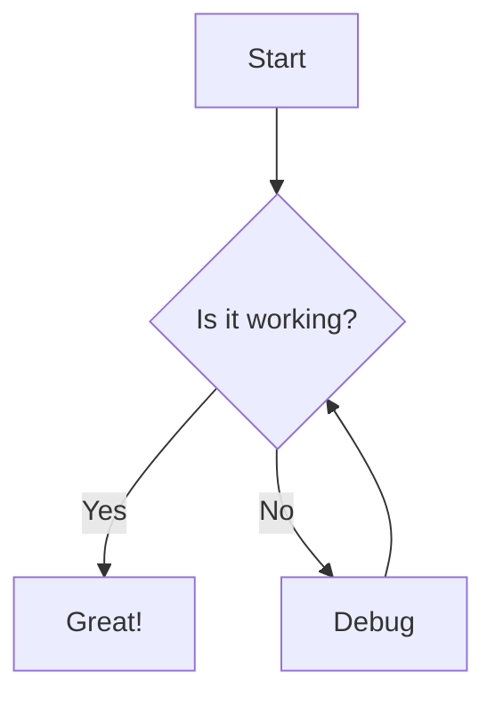
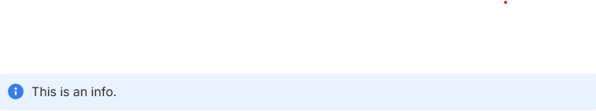

# Getting Started

## Requirements

* Python 3.11+
* PIP

## Installation

You can install this tool using `pip`:

```bash
pip install md-to-conf
```

## Usage

### Basic

The minimum accepted parameters are the markdown file to upload as well as the Confluence space key you wish to upload to. For the following examples assume 'Test Space' with key: `TST`.

```bash
md-to-conf readme.md TST
```

Mandatory Confluence parameters can also be set here if not already set as [environment variables](#environment-variables):

* **-u** **--username**: Confluence User
* **-p** **--apikey**: Confluence API Key
* **-o** **--orgname**: Confluence Organization

```bash
md-to-conf readme.md TST -u basil -p abc123 -o fawltytowers
```

Use **-h** to view a list of all available options.

### Publishing Multiple Files

You can publish several Markdown files in a single command by passing multiple paths or a glob pattern. All files are published to the same space and under the same ancestor page.

```bash
# Explicit list
md-to-conf intro.md guide.md reference.md TST -a "Documentation"

# Glob pattern (all .md files in the docs/ folder)
md-to-conf "docs/*.md" TST -a "Documentation"

# Recursive glob (all .md files in a directory tree)
md-to-conf "docs/**/*.md" TST -a "Documentation"
```

#### Excluding Files

Use `--exclude` to skip files that match a glob pattern. It can be repeated:

```bash
# Exclude draft files from a wildcard publish
md-to-conf "docs/**/*.md" TST -a "Documentation" \
  --exclude "docs/drafts/**" \
  --exclude "docs/wip*.md"
```

You can also prefix individual paths with `!` inline:

```bash
md-to-conf "docs/*.md" "!docs/draft.md" TST -a "Documentation"
```

Both forms can be combined. `--exclude` and `!`-prefixed entries are equivalent and applied after all include patterns are resolved.

#### Cross-Document Link Resolution

When multiple files are published together, any relative Markdown links between them are automatically rewritten to the correct Confluence page URLs — including optional `#fragment` anchors:

```markdown
<!-- in guide.md -->
See the [Reference](reference.md) for details.
Or jump straight to the [API section](reference.md#api).
```

After publishing, those links will point to the live Confluence pages. Links to files that are **not** part of the current batch are left unchanged.

> **Note:** Cross-document link resolution uses a two-pass approach — all pages are created or updated first so that every page ID is known, then links are resolved and pages are updated a second time.

### Environment Variables

To use it, you will need your Confluence username, API key and organization name.
To generate an API key go to [https://id.atlassian.com/manage/api-tokens](https://id.atlassian.com/manage/api-tokens).

You will also need the organization name that is used in the subdomain.
For example the URL: `https://fawltytowers.atlassian.net/wiki/` would indicate an organization name of **fawltytowers**.

If the organization name contains a dot, it will be considered as a Fully Qualified Domain Name.
For example the URL: `https://fawltytowers.mydomain.com/` would indicate an organization name of **fawltytowers.mydomain.com**.

These can be specified at runtime or set as Confluence environment variables
(e.g. add to your `~/.profile` or `~/.bash_profile` on Mac OS):

``` bash
export CONFLUENCE_USERNAME='basil'
export CONFLUENCE_API_KEY='abc123'
export CONFLUENCE_ORGNAME='fawltytowers'
```

On Windows, this can be set via system properties.

### Other Uses

Use **-a** or **--ancestor** to designate the name of a page which the page should be created under.

```bash
md-to-conf readme.md TST -a "Parent Page Name"
```

Use **-d** or **--delete** to delete the page instead of create it. Obviously this won't work if it doesn't already exist.

Use **-n** or **--nossl** to specify a non-SSL url, i.e. **<http://>** instead of **<https://>**.

Use **-l** or **--loglevel** to specify a different logging level, i.e **DEBUG**.

Use **-s** or **--simulate** to stop processing before interacting with confluence API, i.e. only
 converting the markdown document to confluence format.

Use **--title** to set the title for the page, otherwise the title is going to be the first line in the markdown file.

Use **--remove-emojies** to remove emojies if there are any. This may be needed if the database doesn't support emojies.

### Mermaid Diagrams

Use **--mermaid** to render [Mermaid](https://mermaid.js.org/) diagram code blocks as PNG images before uploading.

```bash
md-to-conf architecture.md TST --mermaid
```

Mermaid blocks in your Markdown are written as fenced code blocks with the `mermaid` language tag:

````markdown

````

#### Rendering Strategies

The tool attempts rendering in the following order:

1. **Local `mmdc` CLI** — Used when `mmdc` is found on your `PATH`. This is the fastest option, requires no network access, and produces the highest-quality output.

   Install via npm:
   ```bash
   npm install -g @mermaid-js/mermaid-cli
   ```

2. **`mermaid.ink` public API** — Automatic fallback when `mmdc` is not available. Requires outbound HTTPS access. No installation needed.

If rendering fails for a diagram, the original code block is left intact and a warning is logged.

> **Tip:** For CI/CD pipelines without npm available, the `mermaid.ink` fallback means `--mermaid` works out of the box with no additional tooling.

## Markdown

The original markdown to HTML conversion is performed by the Python **markdown** library.
Additionally, the page name is taken from the first line of  the markdown file, usually assumed to be the title.
In the case of this document, the page would be called: **Markdown to Confluence Converter**.

Standard markdown syntax for images and code blocks will be automatically converted.
The images are uploaded as attachments and the references updated in the HTML.
The code blocks will be converted to the Confluence Code Block macro and also supports syntax highlighting.

### Doctoc

If present, what is between the [doctoc](https://github.com/thlorenz/doctoc) anchor format:

```less
<!-- START doctoc ...
...
... END doctoc -->
```

will be replaced by confluence "toc" macro leading to something like:

```html
<h2>Table of Content</h2>
<p>
    <ac:structured-macro ac:name="toc">
      <ac:parameter ac:name="printable">true</ac:parameter>
      <ac:parameter ac:name="style">disc</ac:parameter>
      <ac:parameter ac:name="maxLevel">7</ac:parameter>
      <ac:parameter ac:name="minLevel">1</ac:parameter>
      <ac:parameter ac:name="type">list</ac:parameter>
      <ac:parameter ac:name="outline">clear</ac:parameter>
      <ac:parameter ac:name="include">.*</ac:parameter>
    </ac:structured-macro>
    </p>
```

### Information, Note and Warning Macros

> **Warning:** Any blockquotes used will implement an information macro. This could potentially harm your formatting.

Block quotes in Markdown are rendered as information macros.

```less
> This is an info
```



```less
> Note: This is a note
```


```less
> Success: This is a success
```


```less
> Warning: This is a warning
```


```less
> Error: This is an error
```


Alternatively, using a custom Markdown syntax also works:

```less
~?This is an info.?~

~%This is a warning.%~

~^This is a success.^~

~$This is an error.$~

~!This is a note.!~
```
